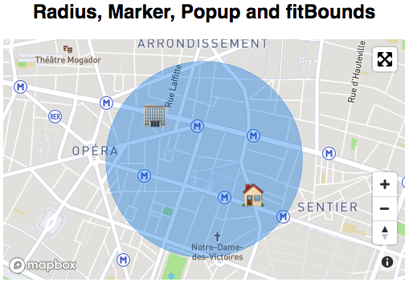

# react-mapbox-wrapper

[](https://travis-ci.org/MeilleursAgents/react-mapbox-wrapper)
[](https://badge.fury.io/js/react-mapbox-wrapper)
[](https://codecov.io/gh/MeilleursAgents/react-mapbox-wrapper)

React wrapper for [mapboxgl-js API](https://www.mapbox.com/mapbox-gl-js/api/).

Made with ❤️ by [MeilleursAgents](https://www.meilleursagents.com)



## Usage

```js
import React from 'react';
import MapboxMap from 'react-mapbox-wrapper';

export default function SimpleMap() {
    return (
        <div style={{ height: 400, width: 400 }}>
            <MapboxMap
                accessToken="<your acess token here>"
                coordinates={{ lat: 48.872198, lng: 2.3366308 }}
            />
        </div>
    );
}

SimpleMap.displayName = 'SimpleMap';
```

See [examples](examples/src/) folder for more example.

## Getting started

Read carefully the [getting started section](https://www.mapbox.com/mapbox-gl-js/api/) of Mapbox GL API.

If you use Webpack, you should add the following parameter in order to properly build your app.

```js
module: {
    noParse: /(mapbox-gl)\.js$/,
}
```

`react-mapbox-wrapper` import the corresponding CSS stylesheet from Javascript, you don't have to do it.

## API

### MapboxMap

React Component that render a Mapbox Map. Extra props are directly passed to the [Map constructor](https://www.mapbox.com/mapbox-gl-js/api/#map). Following props are handled by wrapper for updating or handling behavior in the React philosophy.

Wrapper is CSS flex-ready for _width_ but you **have to set a height** for having visible Mapbox.

| Props                     | Type   | Default            | Description                                                                                                                                                                                                                                                                                                                        |
| ------------------------- | ------ | ------------------ | ---------------------------------------------------------------------------------------------------------------------------------------------------------------------------------------------------------------------------------------------------------------------------------------------------------------------------------- |
| accessToken               | String | required           | Mapbox Access Token ([find it here](https://www.mapbox.com/account/access-tokens))                                                                                                                                                                                                                                                 |
| coordinates               | Object | required           | Coordinates of the map center <br /> According to the [LngLatLike](https://www.mapbox.com/mapbox-gl-js/api/#lnglatlike) model                                                                                                                                                                                                      |
| className                 | string | `''`               | `className` added to map's wrapper. Your should provide a height in order to render the map (default at 0)                                                                                                                                                                                                                         |
| children                  | Node   | `null`             | Rendered children, typically a [Marker](#Marker) and/or [Circle](#Circle)                                                                                                                                                                                                                                                          |
| minZoom                   | number | `undefined`        | The minimum zoom level of the map (0-24).                                                                                                                                                                                                                                                                                          |
| maxZoom                   | number | `undefined`        | The maximum zoom level of the map (0-24).                                                                                                                                                                                                                                                                                          |
| zoom                      | number | `15`               | The viewport zoom                                                                                                                                                                                                                                                                                                                  |
| onChange                  | func   | `undefined`        | Callback function called on every viewport change (`moveend`, `zoomend`) <br /><br /> Callback receives params as first argument with the following shape `{ zoom: 15, coordinates: { lng: 3.4, lat: 1.2 } }` and [Mapbox Map object](https://www.mapbox.com/mapbox-gl-js/api/#map) as second argument                             |
| onClick                   | func   | `undefined`        | Callback function called on [map's click](https://www.mapbox.com/mapbox-gl-js/api/#map.event:click)                                                                                                                                                                                                                                |
| onLoad                    | func   | `undefined`        | Callback function called on [map's load](https://www.mapbox.com/mapbox-gl-js/api/#map.event:load) with current Mapbox instance param                                                                                                                                                                                               |
| onZoomStart               | func   | `undefined`        | Callback function called on [map's zoomstart](https://www.mapbox.com/mapbox-gl-js/api/#map.event:zoomstart)                                                                                                                                                                                                                        |
| onZoomEnd                 | func   | `undefined`        | Callback function called on [map's zoomend](https://www.mapbox.com/mapbox-gl-js/api/#map.event:zoomend) with a debounce of 300ms in order to avoid too many `render()` call <br /><br /> Callback receives event object as first argument and [Mapbox Map object](https://www.mapbox.com/mapbox-gl-js/api/#map) as second argument |
| renderNotSupported        | func   | _Simple message_   | Callback function called when [browser does not support mapbox-gl](https://www.mapbox.com/mapbox-gl-js/api/#supported)                                                                                                                                                                                                             |
| mapboxStyle               | String |                    | [Mapbox style layer](https://www.mapbox.com/mapbox-gl-js/style-spec/)                                                                                                                                                                                                                                                              |
| withCompass               | bool   | `false`            | Show compass [Navigation Control](https://www.mapbox.com/mapbox-gl-js/api/#navigationcontrol)                                                                                                                                                                                                                                      |
| withFullscreen            | bool   | `false`            | Show [Fullscreen Control](https://www.mapbox.com/mapbox-gl-js/api/#fullscreencontrol)                                                                                                                                                                                                                                              |
| withZoom                  | bool   | `false`            | Show zoom [Navigation Control](https://www.mapbox.com/mapbox-gl-js/api/#navigationcontrol)                                                                                                                                                                                                                                         |
| fullscreenControlPosition | string | `top-right`        | Set [Fullscreen Control](https://www.mapbox.com/mapbox-gl-js/api/#fullscreencontrol) position                                                                                                                                                                                                                                      |
| navigationControlPosition | string | `bottom-right`     | Set [Navigation Control](https://www.mapbox.com/mapbox-gl-js/api/#navigationcontrol) position                                                                                                                                                                                                                                      |
| navigationType            | Object | `{type: "jumpTo"}` | Set type of navigation when changing coordinates: `flyTo`, `easeTo` or `jumpTo`. You can change speed and curve options for type `flyTo` as follows: `{type: "flyTo", options: {curve: 1.42, speed: 1.2}}`                                                                                                                         |

### Marker

React Component that render a Marker. Extra props are directly passed to the [Marker constructor](https://www.mapbox.com/mapbox-gl-js/api/#marker)

| Props            | Type   | Default  | Description                                                                                                               |
| ---------------- | ------ | -------- | ------------------------------------------------------------------------------------------------------------------------- |
| children         | Node   | `null`   | Marker HTML DOM, default marker will be used if not provided                                                              |
| coordinates      | Object | required | Coordinates of the marker <br /> According to the [LngLatLike](https://www.mapbox.com/mapbox-gl-js/api/#lnglatlike) model |
| draggable        | bool   | `false`  | Allow user to drag'n'drop Marker                                                                                          |
| getRef           | func   |          | Callback function called with marker's ref (useful for calling `#moveToTop()` function)                                   |
| map              | Object | required | Mapbox Map where marker will be added (can be obtained with MapboxMap#onLoad props fn)                                    |
| onDragEnd        | func   |          | Callback function called on [marker's dragend](https://www.mapbox.com/mapbox-gl-js/api/#marker.event:dragend)             |
| onMouseOut       | func   |          | Callback function called on marker or popup mouseOut                                                                      |
| onMouseOver      | func   |          | Callback function called on marker or popup mouseOver                                                                     |
| popup            | Node   |          | Popup attached to the marker, displayed on click to marker                                                                |
| popupAnchor      | string | `bottom` | [Popup anchor param](https://www.mapbox.com/mapbox-gl-js/api/#popup)                                                      |
| popupCloseButton | bool   | `false`  | [Popup closeButton param](https://www.mapbox.com/mapbox-gl-js/api/#popup)                                                 |
| popupOffset      | number |          | [Popup offset param](https://www.mapbox.com/mapbox-gl-js/api/#popup)                                                      |
| popupOnOver      | bool   | `false`  | Trigger popup show on mouse over (only available if **children** are provided, default marker cannot be bind)             |

### Circle

React Component that render a Circle. Extra props are directly passed to the [Marker constructor](https://www.mapbox.com/mapbox-gl-js/api/#marker)

| Props       | Type   | Default      | Description                                                                                                               |
| ----------- | ------ | ------------ | ------------------------------------------------------------------------------------------------------------------------- |
| coordinates | Object | required     | Coordinates of the marker <br /> According to the [LngLatLike](https://www.mapbox.com/mapbox-gl-js/api/#lnglatlike) model |
| id          | string | required     | Identifier of circle, used to name the underlying layer                                                                   |
| map         | Object | required     | Mapbox Map where marker will be added (can be obtained with MapboxMap#onLoad props fn)                                    |
| onClick     | func   |              | Callback function called on circle's click                                                                                |
| paint       | Object |              | [Paint option of the layer](https://www.mapbox.com/mapbox-gl-js/style-spec#layer-paint)                                   |
| radius      | number | required     | Radius of circle, in kilometers                                                                                           |
| unit        | string | `kilometers` | Unit of the radius. values can be : `kilometers`, `meters`, `miles`, `feet`                                               |

### Helpers

We provide some [helpers](https://github.com/MeilleursAgents/react-mapbox-wrapper/blob/master/src/Helpers/index.js) for interacting with Mapbox Map object, all in `Helpers` import.

```js
import { Helpers } from react-mapbox-wrapper;

Helpers.convertRadiusUnit(580, 'meters');
// > { radius: 0.58, unit: 'kilometers' }

Helpers.getCircleData({ lat: 48.868526, lng: 2.3434886 }, 800, 'meters')
// > Coordinates for drawing a circle with a 800meters radius at given coordinates

Helpers.coordinatesAreEqual({ lat: 48.868526, lng: 2.3434886 }, [2.3434886, 48.868526]);
// > Check if given coordinates are equal, even in different format

Helpers.newBounds(coordinatesSouthWest, coordinatesNorthEast);
// > Create a new LngLatBounds from Mapbox library

Helpers.newBound(coordinates);
// > Create a new LngLatLike from Mapbox library

Helpers.drawGeoJSON(map, 'foodTruck', data, { 'fill-opacity': 0.2 }, undefined, 'fill');
// > Draw a geoJSON with given data and type. Can be used to also update geoJSON if layer already exist

Helpers.removeGeoJSON(map, 'foodTruck');
// > Remove the layer previously added with #addGeoJSON method
```

## Development

```bash
npm install && npm run peers # install both dependencies and peers
```

You can use [`npm link`](https://docs.npmjs.com/cli/link) while developing new features on this repo for use in targeted repository.

```bash
npm link
```

### Git hooks

You can use our `pre-commit` hook for ensuring consistent format and linting before committing by running command:

```bash
./tools/install_hooks.sh
```
